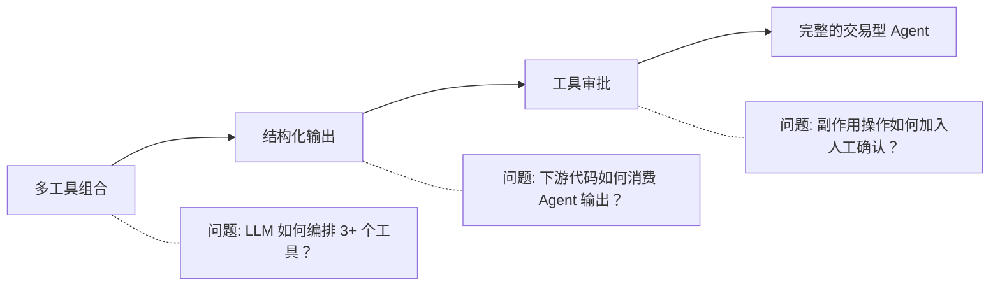

# 工具使用设计模式

工具是 Agent 的手。有了工具，Agent 不再局限于"能聊天"，而是"能办事"——查询数据、检查状态、执行交易。

本课以"旅行预订代理"为场景，讲解三种工具使用设计模式：多工具组合、结构化输出、工具审批。

## 介绍

本课将回答以下问题：

- Agent 同时持有多个工具时，LLM 如何自主编排调用顺序？
- 下游代码如何可靠消费 Agent 的输出（而不是解析自由文本）？
- 副作用操作（预订、扣款）如何加入人工审批？

## 学习目标

完成本课后，你将能够：

- 手写多工具的 tool calling 循环，理解 LLM 如何在多个工具间自主选择
- 用 Pydantic 模型定义输出契约，让 Agent 输出可被代码可靠消费
- 实现工具审批模式，在敏感操作执行前加入人工确认

## 场景：旅行预订代理

一个完整的交易型 Agent 需要四类工具：

| 工具 | 作用 | 敏感操作 |
|------|------|---------|
| `get_destinations` | 获取可用的目的地列表 | 否 |
| `check_availability` | 检查目的地是否可预订 | 否 |
| `get_flight_info` | 查询航班信息 | 否 |
| `book_flight` | 预订航班 | **是** |

三个查询工具让 Agent "能看"，一个预订工具让 Agent "能动"。本课的核心问题就是：怎么让 LLM 在四个工具间自主编排，同时确保预订操作不越权。

## 三种工具使用设计模式



### 模式 1：多工具组合

**核心思想**：把所有工具的 JSON Schema 一次性传给 LLM，LLM 自己决定调谁、调几次、按什么顺序。

你不需要写 if-else 做路由，不需要定义调用流程图。LLM 本身就是一个足够好的编排器。你只需要：

1. 把工具 Schema 放在一个列表里传给 LLM
2. 根据 LLM 返回的函数名执行对应函数
3. 把执行结果传回去，让 LLM 决定下一步

在原生 SDK 中体现为 `TOOLS_SCHEMA` 列表和 `TOOL_MAP` 字典；在 qwen-agent 中体现为 `function_list=["get_destinations", "check_availability", "get_flight_info"]`。

### 模式 2：结构化输出

**核心思想**：用 Pydantic 模型定义输出契约，在 system prompt 中指定 JSON 格式，用 `model_validate_json()` 做最后一道验证。

输出契约示例（BookingRecommendation）：

| 字段 | 类型 | 说明 |
|------|------|------|
| `destination` | str | 目的地名称 |
| `available` | bool | 是否可预订 |
| `flight_details` | str | 航班详情 |
| `estimated_cost` | int | 预估费用（美元） |

格式约束写在 system prompt 中，而不是依赖框架的 `response_format` 参数——这样换框架时 prompt 不用改，Pydantic 独立完成验证。

### 模式 3：工具审批

**核心思想**：敏感操作不能自动执行。在工具函数真正运行前，用 `input()` 停住进程，等待人工确认。

实现方式有两种：

- **原生 SDK**：在 tool calling 循环中维护一个 `SENSITIVE_TOOLS` 集合，执行前检查并拦截
- **qwen-agent**：在 `BaseTool.call()` 内部直接写 `input()` 拦截逻辑

两种方式本质一样——都是 Python 代码层面的拦截，不依赖框架特性。

## 框架对比速查

| 概念 | 原生 SDK | qwen-agent |
|------|----------|------------|
| 工具定义 | JSON Schema + Python 函数 | `@register_tool` + `BaseTool` 子类 |
| 多工具组合 | `TOOLS_SCHEMA` 列表 | `function_list=["tool1", "tool2", ...]` |
| 工具参数 | JSON Schema `properties` + `required` | 字典列表 `[{"name": ..., "type": ..., "required": ...}]` |
| 结构化输出 | system_message 指定 JSON + Pydantic 验证 | 同左（框架无 `response_format`） |
| 审批模式 | tool calling 循环中拦截 `SENSITIVE_TOOLS` | `BaseTool.call()` 内部 `input()` 拦截 |
| tool calling 循环 | `while True` 手动管理 | `Assistant.run()` 内部自动完成 |

## 学习方法：三步走

1. **阅读概念** → 读本 README，理解三种模式的要解决的问题和核心思想
2. **手写原生版** → 打开 `code_samples/04-python-agent-framework.py`，理解 tool calling 循环在 3+ 工具时的完整形态
3. **用框架重写** → 打开 `code_samples/04-qwen-agent-framework.py`，看 `@register_tool` + `Assistant` 如何消除样板代码

对比两份代码，你会清楚框架替你做了什么、没做什么。

## 运行

```bash
cd 04-tool-use/code_samples

# 原生 SDK 版
pip install openai python-dotenv pydantic
python 04-python-agent-framework.py

# qwen-agent 框架版
pip install -U "qwen-agent[gui]" pydantic
python 04-qwen-agent-framework.py

# 要体验工具审批模式，编辑代码取消注释 demo_3_approval_mode()
```

## 文件清单

| 文件 | 说明 |
|------|------|
| `code_samples/04-python-agent-framework.py` | 原生 SDK 版：手写 tool calling 循环 + 多工具 + 结构化输出 + 审批拦截 |
| `code_samples/04-qwen-agent-framework.py` | qwen-agent 框架版：`@register_tool` + `Assistant` + `BaseTool.call()` 审批 |
| `code_samples/README.md` | 代码学习指南，含详细对比表 |

## 延伸

- 上一课：[Agentic 设计模式](../03-agentic-design-patterns/README.md)
- 下一课：[Agentic RAG](../05-agentic-rag/README.md)
- 博客：[Agent 工具使用设计模式](./bolg/note-agent-tool-use.mdx)
- [千问 API 文档](https://help.aliyun.com/zh/model-studio/qwen-api-reference-hk)
- [qwen-agent 源码](https://github.com/QwenLM/Qwen-Agent)
